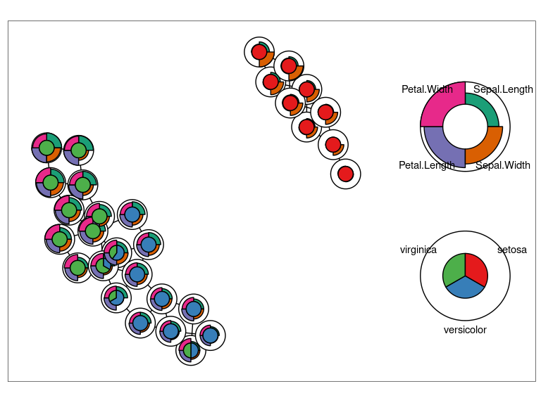
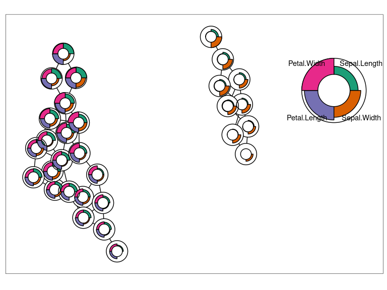

# gng: Growing Neural Gas in RCpp

<!-- badges: start -->

<!-- badges: end -->

An implementation of the Growing Neural Gas algorithm in Rcpp.

## Example

Here’s an example of running a GNG on the iris dataset (which, arguably,
doesn’t make much sense).

    library(gng)
    data(iris)

    x <- as.matrix(iris[,1:4])
    gng_fit <- gng(x)

You can visualise the GNG nodes as follows.

    plot_gng(gng_fit, plot_labels = iris[,5])

    plot_gng(gng_fit, plot_labels = iris[,5], plot_expression = NULL)

    plot_gng(gng_fit)

